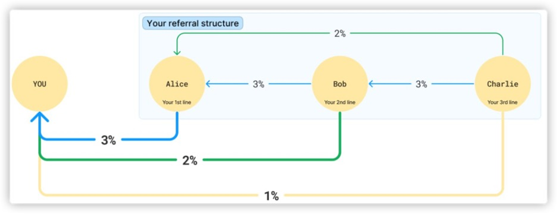
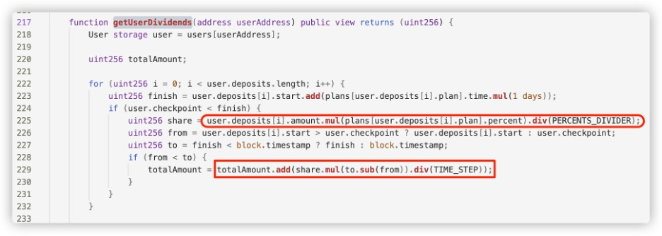
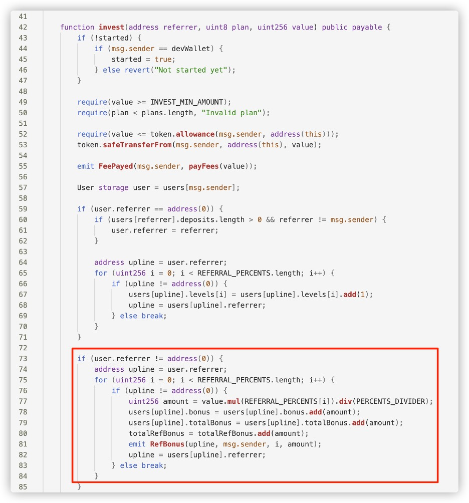
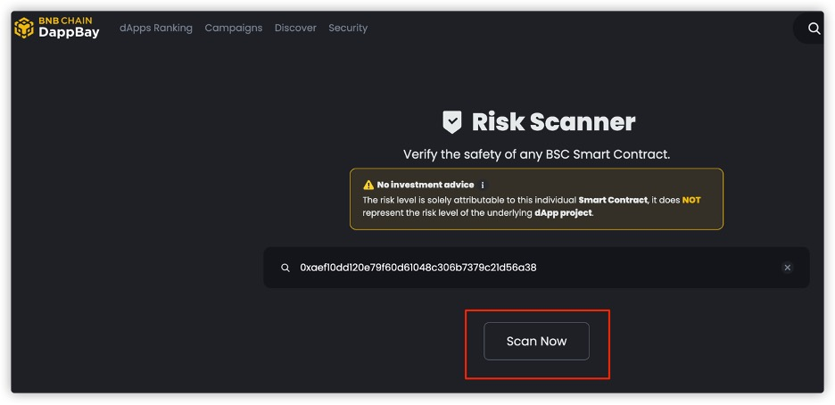
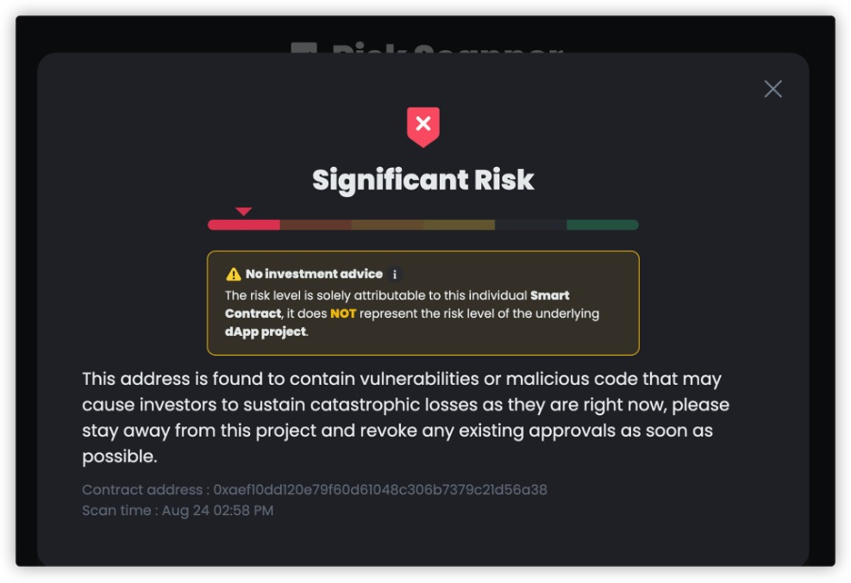
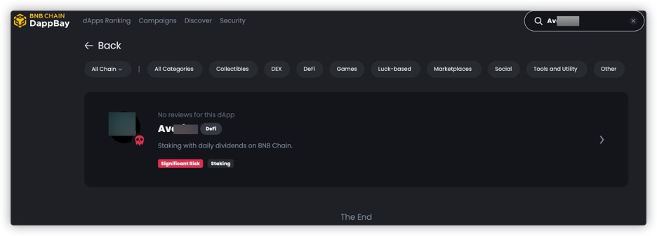

## Ponzi Schemes in Web3 --- Swamps in the Dark 

*A guide on how to stay safe when interacting with DeFi
projects*


### [Disclaimer](https://hashdit.github.io/hashdit/blog#disclaimer)

*The information provided through HashDit does not constitute advice or
recommendations for investment or trading. HashDit is not responsible
for any of your investment decisions. Please seek professional advice
before taking financial risks.*

### What's a "ponzi"?

According to [Wikipedia](https://en.wikipedia.org/wiki/Ponzi_scheme),
the **Ponzi scheme** is a form of fraud that lures new investors and
pays profits to earlier investors with funds from more recent investors.
As you can imagine, if recent investors pay to earlier investors
then... who pays the recent investors? The answer is, the even more
recent investors. And if there are no more recent investors, then the
latest ones remain with a loss, and the scheme collapses.

The ponzi scheme is often referred to as pyramid scheme,
because to pay the "higher floor" investors with a profit, a
larger, "lower floor" has to be created, like in the picture below.

![IMG-1]./(media/image1.jpg)

*https://sperrinlaw.net/financial-crime-fraud/ponzi-fraud/*

Since the pyramid is not a real business, in terms of creating a
product or a service and leveraging it to earn money on the market, in
order to keep the funds flowing in, new investors have to be recruited
and their "investment" is used to pay the old investors, who can then
report significant returns on their investments. This creates an
illusion of a profitable business, at least as long, as the current
"lowest floor" manages to recruit new members.

If that's so obvious, then why people keep falling for it? Usually, the
ponzi schemes are disguised as legitimate investments or projects. They
will do everything to hide it's true nature so the new coming investors
will believe they just met an investment of their lifetime. And when the
scheme falls, it's already too late to run away.

Are there ponzi schemes in web3? If so, how to spot them? How not to
lose money? Read on to learn more!


### Ponzi schemes in Web3

Although Ponzi schemes originated in the traditional financial world,
with the development of DeFi (Decentralized Finance), these fraudulent
business models have also started to emerge in Web3.
Web3 Ponzi schemes take advantage of the following features of DeFi,
attracting investors through high returns and incentives.

1. **Anonymity:** The decentralized nature of DeFi allows Ponzi scheme
operators to remain anonymous, making it difficult to trace and hold
them accountable.

2. **Utilizing smart contracts:** A smart contract is a self-executing,
self-enforcing protocol governed by its explicit terms and conditions.
It stores and carries out contractual clauses via blockchain. These
schemes use smart contracts to automate their operations, making them
harder to detect while promising high returns on investments.

3. **Tokenization:** Some Ponzi schemes create their own tokens and use
them for fundraising. They offer high rewards in the form of tokens,
which may have little to no real value.

4. **Limited regulation:** The DeFi space has limited regulation,
making it easier for Ponzi schemes to operate without being detected or
shut down by financial authorities.

5. **Low cost:** Ponzi scheme projects can be fully autonomous and
deployed at lower costs. They can even be continuously cloned.


**So, how can one identify if a Web3 DeFi project is a Ponzi scheme or
not?**

Firstly, let's look at the project characteristics. Ponzi schemes
usually have the following features:

1. Typical Web3 Ponzi schemes often employ **aggressive marketing**
tactics, promising **high and fixed short-term returns**. For example,
the official websites of such projects usually contain descriptions like
"**fixed daily profit**". However, we know that fixed daily returns
are unrealistic, and this is one of the biggest flaws in Ponzi schemes.
In the cases we've accumulated, some Ponzi projects have even promised
**25% daily** interest rates!

2. **High Referral Incentives**: Ponzi schemes often combine with
pyramid scheme marketing, aiming to attract more new investors and
subsequent investment funds. Therefore, they often advertise a referral
reward system on their official websites, sometimes even with
multi-level referral rewards. Typical pyramid scheme descriptions
include terms like "tiered referral rewards."
The two images below are tiered referral reward system diagrams taken
from Ponzi scheme websites:

 

 


3. These schemes usually disguise themselves as **staking or mining**
projects to attract investors' principal investments and recruit new
participants. However, in fact, they generally do not offer any real
products or services but just **promise an ability to make money**. They
often incorporate some popular trends, for example, AI or ChatGPT,
promoting their projects as groundbreaking and innovative, as they need
to attract more people and **maintain an appearance of legitimacy**.

Below are some additional features that can help investors determine
whether a project is a Ponzi scheme. Please note that these traits are
not exclusive to Ponzi scheme projects. Generally, the more of these a
project has, the higher the risk:

1.  No proper investments: The project appears to have no investments
    or partnerships, which means that the project lacks any business
    endorsements.

2.  Opaque team information: The team behind the project remains
    anonymous to the public, making it easier for such projects to
    engage in malicious activities with lower costs.

3.  Lack of documentation: There is a lack of documentation and
    whitepapers, as the project does not provide details about its
    internal operations and how it achieves these high returns. This is
    a potential red flag.

4.  No external audit report: Projects with audit reports generally
    have a relatively smaller chance of encountering security issues.
    However, please note that having an audit report does not guarantee
    absolute security, as the audit report may only cover certain
    contracts and not examine the entire economic ecosystem of the
    project. The reliability of the audit report is also important,
    depending on the issuer and quality; well-known and reputable audit
    companies usually have greater credibility.


### Decrypting a Ponzi project smart contract

Are you a more tech-savvy user? That's great. If you have some
familiarity with Solidity code or want to learn it, we encourage you to
go through the code snippets below to understand some of the
characteristics of Ponzi scheme smart contracts.

As we mentioned earlier, Ponzi scheme Web3 projects generally don't
have any real products, and therefore don't require many smart
contracts. In their entire project ecosystem, there are usually only a
few investment contracts that directly interact with users. At most,
there might be an additional token contract, with the token often
serving as a staking reward. However, this token typically won't be
created on any decentralized exchange (DEX), meaning that holders of
this token cannot swap it for other valuable tokens or
stablecoins.

Next, we will delve into the characteristics of Ponzi investment smart
contracts by using some code snippets as examples.


1.  **There is no method in the contract to withdraw the initial
    investment; it only allows for receiving dividends based on time**

    For example, in the below withdraw function, users cannot withdraw
    their principal investment; they can only withdraw dividends along
    with potential referral earnings.

 This is also the difference between Ponzi schemes and regular
 mining/staking contracts.

 

2.  **Dividends are calculated based on a fixed daily returns ROI and
    time.**
    For example, in the getUserDividends function below, the user's
    dividend is calculated by multiplying the fixed daily return rate
    for the user's deposit plan by the time elapsed. Typically, the
    daily return ROI is a hard-coded value or constant.

 


3.  **The code contains logic related to a Referral system.**
    As we mentioned earlier, Ponzi investment smart contracts usually
    include a referral system, providing users with additional
    incentives for bringing new users into the scheme.

    For example, in the contract below, there is a tiered referral
    reward mechanism, with first, second, and third-level referrers
    receiving referral rewards at a ratio of 9:2:1.

 

 Of course, the referral rewards come from the principal investment of
 later investors. As can be seen, the invest function in the code
 distributes part of the user's investment amount to all referrers at
 their respective levels.

 


4.  **The project party generates revenue by charging tax fees on
    users' deposits.**
    For example, in the code below, the project party charges a 5% dev
    fee on the user's principal, so they can profit as long as there
    are new users, regardless of how much money remains in the
    pool.

 

 


 However, sometimes the project party does not directly impose a tax
 fee, claiming to have a 0% tax fee. In reality, the project party can
 become the initial referrer and continuously profit through the
 referral mechanism. This method of profiting is just more
 concealed.

### **Go further: A complete Ponzi example for more tech-savvy users**

Let's go further! we created a sample ponzi scheme code based on what
we're finding during our everyday work. We encourage you to study below
simple smart contract code.


```solidity
pragma solidity ^0.8.0;

contract PonziScheme {
    address public owner;
    mapping(address => uint) public investments;
    mapping(address => uint) public recruits;
    mapping(address => uint) public investmentTimestamp;

    constructor() {
        owner = msg.sender;
    }

    function recruitAndInvest(address referralAddress) public payable {
        require(msg.sender != referralAddress, "Cannot refer yourself");
        require(investments[msg.sender] == 0, "Already invested");
        require(msg.value == 0.1 ether, "Investment should be 0.1 Ether for recruitment bonus");
        // Add the recruit count for the referrer
        recruits[referralAddress]++;
        // Add the investment for the new investor with the bonus
        investments[msg.sender] = msg.value + 0.1 ether; // 0.1 ether bonus
        investmentTimestamp[msg.sender] = block.timestamp;
    }

    function calculateTotalReturn(address investor) public view returns(uint) {
        uint numberOfRecruits = recruits[investor];
        uint baseInvestment = investments[investor];
        uint profit = 0;
        if (numberOfRecruits >= 10) {
            profit = baseInvestment * 50 / 100; // 50% ROI
        } else if (numberOfRecruits >= 5) {
            profit = baseInvestment * 25 / 100; // 25% ROI
        }
        return baseInvestment + profit; // Total return = initial investment + profit
    }

    function cashOut() public {
        uint totalReturn = calculateTotalReturn(msg.sender);
        if (totalReturn == investments[msg.sender]) {
            require(block.timestamp >= investmentTimestamp[msg.sender] + 90 days, "Minimum 90 days required to withdraw without recruits");
        }
        require(address(this).balance >= totalReturn, "Insufficient funds in the contract");
        msg.sender.transfer(totalReturn);
        investments[msg.sender] = 0;
        recruits[msg.sender] = 0;
    }
}

```


-   **Entry Point:** The entry point for new investors is the
    *recruitAndInvest()* function. Here, a new investor specifies a
    referral address (the person who introduced them to the scheme) and
    sends 0.1 ether as their investment. 

-   **Incentive to Recruit:** The incentive to recruit new members is
    twofold: Frist, the referrer gets a count increase in their recruits
    mapping, which will later increase their ROI. Second, the new
    investor gets a bonus of 0.1 ether added to their investment,
    effectively doubling their initial investment. 

-   **Ponzi Mechanics:** The Ponzi nature of the scheme is visible in
    the *calculateTotalReturn* function. The ROI is determined by the
    number of recruits: 5-9 recruits: 25% ROI 10 or more recruits: 50%
    ROI The more people an investor recruits, the higher their promised
    return. 

-   **Potential Collapse:** The scheme can collapse at some point. The
    ability to withdraw funds is implemented in the *cashOut()*
    function. If the contract doesn't have enough funds to pay out the
    total return (initial investment + profit), the cash out will fail.
    This will happen if not enough new investors are coming in to fund
    the returns for earlier investors. The
    *require(address(this).balance >= totalReturn, "Insufficient funds
    in the contract");* line checks for this. 

-   **Safety Net (or Illusion of One):** If an investor hasn't
    recruited at least 5 people, they can only withdraw their initial
    investment after 90 days. This might give the illusion of safety and
    legitimacy, but it's just a delay tactic. During the 90 days, the
    scheme might already rise and fall, and when the time for withdrawal
    comes, there might already be no funds on the contract.


Now you have a deeper understanding of the contract code for Ponzi
schemes. However, in reality, some Ponzi smart contracts are even
closed-source, making them opaque and more difficult to analyze and
understand, thereby concealing the contract's logic and risks from
users. When dealing with closed-source contracts, we should maintain an
even higher level of vigilance and examine both the project and contract
levels comprehensively to determine if they exhibit characteristics of a
Ponzi scheme.

### Identifying Ponzi schemes in a more simple way

In summary, before investing in Web3 DeFi projects, you need to conduct
thorough due diligence to avoid mistakenly entering Ponzi schemes and
incurring losses.

At the project level, conduct comprehensive research on the project
team, token economy, and underlying technology. Be cautious of
unrealistic high return promises, ensure that there is adequate
transparency in the project, and verify that the project has a sound
governance mechanism.


At the smart contract level, fully understand the source code and
determine if there are any red flags in the code, always assessing risks
before gaining a deeper understanding.

However, is this too complicated and difficult? After all, not all
investors are technical experts. Don't worry, HashDit can help
you.

For smart contracts, you can scan whether it is a Ponzi contract
through https://dappbay.bnbchain.org/risk-scanner using the contract
address. Dappbay's scanner is technically supported by HashDit, which
has integrated various recognition rules for Ponzi schemes.





You can also search on the Dappbay website
(https://dappbay.bnbchain.org/r) based on the Dapp's name, Twitter,
website, etc., to see if the project has been marked as significant
risk.



Additionally, you can follow HashDit's X
(https://twitter.com/HashDit). HashDit continuously monitors data on the
BNB chain and provides ongoing alerts for BNB chain-related
risks.

Remember, never invest blindly in the dark forest of Web3. HashDit will
guide you around every "swamp" and protect your Web3 journey!

### Appendix

Below are some Ponzi scam Web3 projects that HashDit has identified in
the past. Please stay alert! At the same time, you can also use these
projects as reference materials to conduct your own research!

(Scroll right on the form below for more information)

| Chain_id | Address                                        | Website                                                                                                                         | Project Name          | Risk Reason Remark                                                                                                        |
|----------|------------------------------------------------|---------------------------------------------------------------------------------------------------------------------------------|-----------------------|---------------------------------------------------------------------------------------------------------------------------|
| 56      | 0x3f3f162e8F172fB681a4Fe9BE187B0FF21fE0734    | [avaricetoken.io](https://avaricetoken.io)                                                                                      | Avarice               | Ponzi Scam Project                                                                                                        |
| 56      |                                                | [bnbdaily.finance](https://bnbdaily.finance/)                                                                                   | BNB Daily Finance     | Ponzi project - Offers unsustainable rates of "DAILY ROI 0.7%". Lack of investments, product, documentation. Opaque team. |
| 56      | 0x3471Cc34ED5d7ceadd0a533dedA18ecC0d6Bd927    | [cashbox.cfd](https://cashbox.cfd/)                                                                                             | Cashbox Investment Pool| High APR/APY. Lack of investments, product, documentation. Opaque team.                                                 |
| 56      |                                                | [finx.global](https://app.finx.global/)                                                                                         | FinSwap               | High APR/APY. Centralization in top holders.                                                                              |
| 56      |                                                | [busdyield.com](https://busdyield.com)                                                                                          | BUSDYield             | Ponzi SCAM Project                                                                                                       |
| 56      |                                                | [twitter.com/x_roi_community](https://twitter.com/x_roi_community)                                                               | TrueFund              | Ponzi scam Project                                                                                                       |
| 56      |                                                | [bnbcrush.io](https://bnbcrush.io)                                                                                              | BNB Crush             | Ponzi scam Project                                                                                                       |
| 56      |                                                | [ai-trader.app](https://ai-trader.app)                                                                                          | AI Trader             | Ponzi scam Project                                                                                                       |
| 56      |                                                | [chronostake.com](https://chronostake.com)                                                                                      | ChronoStake           | Ponzi scam Project                                                                                                       |
| 56      |                                                | [rewardscapital.app](https://rewardscapital.app/)                                                                               | Reward Capital        | Ponzi SCAM Project                                                                                                       |
| 56      |                                                | [sharkbnb.cloud](https://sharkbnb.cloud/)                                                                                       | Shark BNB             | Ponzi SCAM Project                                                                                                       |
| 56      | 0x00000065cBADeAD116136940b302F938284f2BDc    | [poop.fi](https://poop.fi/)                                                                                                     | Poop                  | Ponzi SCAM Project                                                                                                       |
| 56      | 0xa06411Af90C84fa9Ba4168CC08D8618A602826ba    | [staker.cafe](https://staker.cafe/)                                                                                             | Staker Cafe           | Ponzi SCAM Project                                                                                                       |
| 56      |                                                | [matrixpro.vip](https://matrixpro.vip)                                                                                          | Matrix Pro            | Ponzi SCAM Project                                                                                                       |
| 56      | 0x80B48C38Ced124eA15a2c19684877ccE4Ab2D524    | [lamon.app](https://lamon.app/?utm_source=DappRadar&utm_medium=deeplink&utm_campaign=visit-website)                             | Lamon App             | Ponzi SCAM Project                                                                                                       |
| 56      |                                                | [fin-toch.com](https://fin-toch.com/?utm_source=DappRadar&utm_medium=deeplink&utm_campaign=visit-website)                       | FTC                   | Ponzi SCAM Project                                                                                                       |
| 56      | 0xca7Ea9003a9cA60c2adC054a379035723A7a9F49    | [kingdomlegacy.io](https://www.kingdomlegacy.io/?p=0xe81209fB4C63E1aE6A9Cc4498d75cd4C7Ae947CA&utm_source=DappRadar&utm_medium=deeplink&utm_campaign=visit-website) | Kingdom Legacy        | Ponzi SCAM Project                                                                                                       |
| 56      | 0xd96099403F4b47C3046A6Da11d8cAf254D806398    | [towers.pizza](https://towers.pizza/)                                                                                           | Pizza Tower           | Ponzi SCAM Project                                                                                                       |
| 56      | 0xd6f5ea3db32dbdc3e9866e60459788de8a2106c7    | [tripfoundation.io](https://tripfoundation.io/)                                                                                 | Trip Foundation       | Ponzi SCAM Project                                                                                                       |
| 56      | 0x40755D50d6Af0B5955a7491D6A5DA94535c26382    | [snyperfund.com](https://snyperfund.com/?utm_source=DappRadar&utm_medium=deeplink&utm_campaign=visit-website)                   | Snyper Fund           | Ponzi SCAM Project                                                                                                       |
| 56      | 0xaef10dd120e79f60d61048c306b7379c21d56a38    | [bakedpizza.app](https://bakedpizza.app/#?utm_source=DappRadar&utm_medium=deeplink&utm_campaign=visit-website)                  | Baked Pizza           | Ponzi SCAM Project                                                                                                       |
| 56      | 0x7785035610075Ec7BcD7c833B03996E866FE0072    | [blockrewards.pro](https://blockrewards.pro/?utm_source=DappRadar&utm_medium=deeplink&utm_campaign=visit-website)               | Block Rewards         | Ponzi SCAM Project                                                                                                       |
