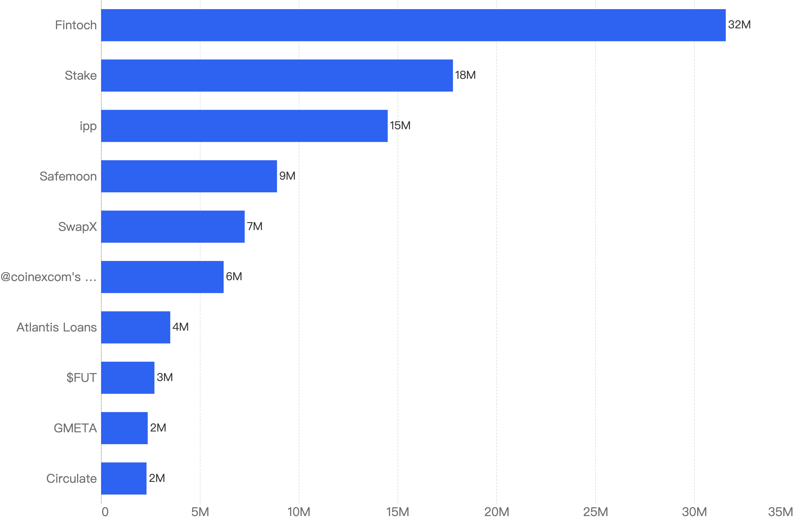

## Top 10 incidents in 2023 

The following were the top 10 security incidents in terms of financial loss in 2023. 

### Fintoch - $32 Million Loss

On 24th May 2023, Fintoch, a Investment Fraud Ponzi Scheme, was found to have exit scammed for ~$32m worth of USDT.

Fintoch advertises a 1% daily APR, the team page listed a false person "Bob Lambert" as their CEO when he is in fact a US based paid actor (Mike Provenzano). The project claimed to be based in Silicon Valley but it was in fact not registered there. Furthermore, Fintoch claimed to be owned by Morgan Stanley. 

Later on, the Singapore Government issued a warning against this fraud and Morgan Stanley issued a similar one as well.

### Stake - $18 Million Loss

On 4th September 2023, the Stake platform was exploited, resulting in almost $18m loss on BSC. Stake is a Betting platform for users to gamble their cryptocurrency on multiple chains. The incident was due to a Private Key Compromise of several of its operating wallets, leading to their funds being directly stolen. However, the eventual root cause was not shared by the project team, and the platform continued business as usual by changing operating wallets subsequently.

### Ipp - $15 Million Loss
On 26th May 2023, the Ipp project conducted a rugpull worth nearly $15m worth of USDT. The project has since deleted all its social media accounts.

The root cause of this rugpull was that there was a backdoor function in the staking contract of the project. The backdoor function allowed the scammers to have privileged access to remove users’ staked funds in the contract. 

### Safemoon - $9 Million Loss
SafeMoon markets itself as a decentralized cryptocurrency with reflection rewards for holders. On 28th March 2023, the project was exploited for roughly $9m worth of WBNB funds.

The vulnerability leading to the attack is because of a bug that was introduced in the latest update. Specifically, the burn() function introduced can be called publicly, and secondly the From address can be externally controlled. This means that any address can technically have its $Safemoon tokens burned from their wallet.

The hacker was able to continually call the burn() method, parsing in the address of the Safemoon-WBNB pool. By destroying the number of $Safemoon in the LP pool, the value of $Safemoon is artificially inflated, allowing the hacker to make a back swap for WBNB and profit. 

### SwapX - $7 Million Loss
On 27th February 2023, SwapX, an AMM project was exploited, resulting in the loss of ~$7m worth of funds on BSC. The victim smart contract which was unverified, had a vulnerable function without proper access control, which misuses the allowances given by other users.

The attacker exploited this vulnerability to swap other users’ funds for other tokens, in other words, users had their funds swapped not on their own accord. As a result, the other tokens such as $DND and $LZ had a price bump which allowed the attacker to make a back swap and profit from the price gap.

### Coinex - $6 Million Loss
On 12th September 2023, Coinex, a CEX was exploited for roughly $6m on BSC. Similar to the Stake platform case, the incident was due to a Private Key Compromise of several of its operating wallets, leading to their funds being directly stolen. 

This case was found to be linked to North Korea's infamous Lazarus group as they laundered funds through multiple channels onchain after the attack.
The project team eventually pledged a 100% refund for all affected users and restarted services after 1 week.

### Atlantis Loans - $4 Million Loss
On 12th June 2023, Atlantis Loans was exploited for around 4m. In this attack, the hacker executed a malicious governance proposal to take over all the core contracts of the ecosystem. During the execution, the hacker managed to take over the Admin role of all those core contracts. As such, he injected a malicious implementation to steal the funds of users that have approved to those contracts in the past.

Interestingly, the first proposal submitted was actively caught by the community and voted off. However, due to the lack of eyes on the project, the 2nd malicious proposal passed the quorum without sufficient Against votes.

### FUT - $3 Million Loss
Early this year, on 4th January 2023, the FUT token rugpulled for nearly $3m worth of funds. These funds were laundered through multiple exchanges.

The loophole is in the Masterchef contract, where there was a backdoor function which allowed the scammer to steal staked funds from users. 

### $GMETA - $2 Million Loss
On 18th July 2023, $GMETA token conducted an exit scam of ~$2m, resulting in a 96% price drop. 

The scam project party minted these large amounts of $GMETA tokens to a dormant address that they have control back in February. Once the price of the token has been pumped substantially, the scammers sold them all for a profit.

### Circulate - $2 Million Loss
On 12th January 2023, Circulate executed a rugpull for roughly $2m worth of BUSD. The scam project party managed to hide a malicious code within the unverified contract to steal funds that were staked in the contract. The funds have since been bridged to ETH and laundered through Tornado Cash

