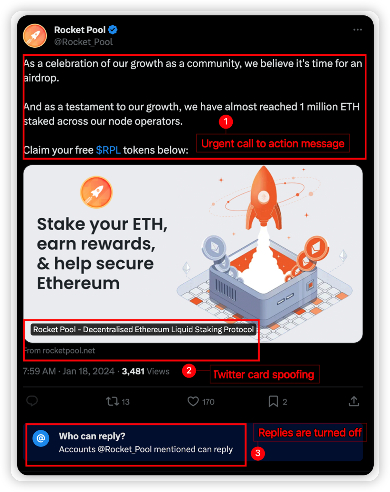
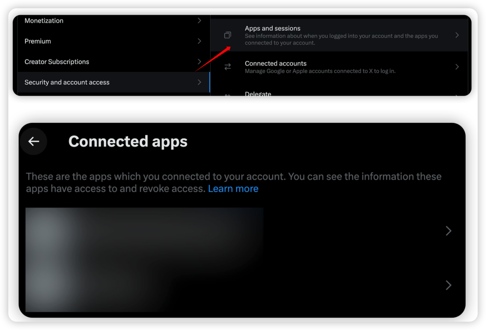

## Twitter Compromise Security Blog

### Introduction

In the landscape of cryptocurrencies, Twitter plays a primary role as a conduit of essential news and real-time updates, weaving itself into the fabric of professional and personal crypto interactions. Yet the importance of this reach brings with it a need for unyielding security. Compromised Twitter accounts - particularly those focused on crypto - pose substantial threats; their impacts can resonate deeply not just within individual digital wallets, but across the entire crypto market. 

In this blog post, we're going to explore both the personal and professional implications of these security breaches, paying special attention to their effects within the crypto community. As we journey through the world of crypto Twitter, grasping the potential threats is crucial to fortifying our digital fortress and nurturing a safe, reliable space for crypto discourse.

### Part 1: Understanding Compromised Accounts

A compromised Twitter account means a legitimate, usually verified account, falls prey to a malicious entity. The attacker obtains control, gaining access to personal data and the power to impersonate the original account holder. In the crypto-Twitter world, this can lead to misinformation, financial manipulation or phishing attacks, posing substantial risks to the wider crypto community. 

There are 3 main risks associated with Compromised Accounts

1. Potential distribution of harmful links or malware. This could occur if the malicious actor uses the hijacked account to send or post dangerous links which, when clicked, could infect a user's device with malware. This puts the user's personal and potentially sensitive data at risk, as malware can be used to steal information, spy on user activity, or even hijack further accounts. 

2. Manipulate trusting followers into making detrimental financial decisions based on misleading guidance. 

3. Security breaches reflect negatively on the organization behind the account, damaging their reputation and casting doubt about their competence in protecting user information and funds. Hence, Twitter account security is crucial to maintaining credibility and safeguarding followers' interests.

There have been several notable accounts (not only Crypto related) that have been compromised just in 2024 so far:

* SEC [Ref](https://x.com/Safety/status/1744924042681897343?s=20)
* Mandiant [Ref](https://x.com/Mandiant/status/1745173809752330385?s=20)
* CoinGecko [Ref](https://x.com/SolanaFloor/status/1745153528744849494?s=20)
* ReStake Finance [Ref](https://x.com/cryptojohnnyfap/status/1746891037249863799?s=20)
* Injective [Ref](https://x.com/lowercaseboot/status/1745203058102161467?s=20)
* Arkham Intelligence’s CEO [Ref](https://x.com/ArkhamIntel/status/1747752146206965956?s=20)

### Part 2: Signs of a Compromised Twitter Account
Recognizing the signs of a compromised Twitter account is crucial to minimize potential damage.

Symptoms include but are not limited to:

1. User point of view

    1. Compromised accounts start making an unexpected tweet from their usual timeline.

        For example, 

        

        * Urgent call to action message

        * Twitter card spoofing is a technique used by the scammers to trick users into believing they are clicking on the official site.

        * Replies are usually turned off to prevent users from calling them out and warning others.

    2. Making unsolicited DMs to everyday users. This will be to gain trust since it appears to be from a trusted source and can be seen from the DM recipient.

    3. Blocking security related accounts that call them out. This is to prevent accounts with wider following from informing others.

2. Compromised account’s point of view

    1. The project party might start noticing unexpected tweets, retweets, or likes appearing on your profile

    2. Receiving direct messages you did not send 

    3. Noticing changes to your account settings such as email, password, or linked phone number that you didn't make

    4. Alerts for login attempts or successful logins from unfamiliar locations, a sudden increase in the number of unknown followers, involuntarily following new accounts

    5. Messages from your followers about suspicious activity or spam originating from your account.

### Part 3: How Twitter Accounts Get Compromised
Understanding how hackers compromise Twitter accounts is key to enhancing your security position.

1. Phishing:

    1 of the most common techniques used is through Social Engineering and Phishing. For example, if DMs are turned on and your social media presence is strong, they target you, gain your trust and subsequently ask you to click and authorize Twitter permissions through a 3rd party site. This 3rd party site will gain access to posting on your behalf, changing passwords and settings etc.

2. SIM Swap Attacks:

    These represent a real threat to Twitter users who've linked their accounts with their mobile numbers, presenting a lucrative attack vector for bad actors. In essence, scammers manipulate this to their advantage to commandeer your account.

3. Password Vulnerability and Lack of 2FA:

    A negligently secure mindset lays the foundation for such attacks. Usage of weak passwords that can fall prey to brute-force attacks and absence of Two-Factor Authentication (2FA) turns the account into low-hanging fruit for hackers.

4. Consequences of Data Breaches:

    Accounts running on the same password across multiple platforms are in jeopardy. The compromise of one account may well trigger a domino effect, subjecting various other accounts to risk too.

5. The Risk of Malware:

    If you're storing passwords unencrypted on your local desktop or making visits to dangerous websites to download potentially malicious applications, you're inadvertently setting the stage for hackers to access your passwords.

### Part 4: How to Secure Your Twitter Account
Understanding the necessary steps to secure your Twitter account is essential to maintaining your privacy and safety online.

To ensure the robust security of your Twitter account, consider the following steps:

1. Creating a strong password is one of the first and most fundamental steps towards securing your online presence. Regularly updating your password can also bolster its resilience against unauthorized access.

    It should be at least 12 characters long and composed of varied elements including a combination of uppercase letters, lowercase letters, numbers, and symbols. Avoid including easily guessable data such as your name, birthdates, or common words. If remembering a complex password seems challenging, consider using a reliable password manager or creating a passphrase, which is a sentence-like string of words that is easy to remember and hard for hackers to crack. 

2. Switch to Non-SMS-Based 2FA: It would be best to activate a non-SMS-based two-factor authentication. Instead of SMS, consider using an authenticator app or, for maximum security, a Yubikey.

3. Regularly Audit Third-Party App Permissions: It's pivotal to periodically verify third-party application permissions linked to your account and screen for any unsanctioned approvals. These could potentially be monitoring your actions. Basic guide is as follows:

    More -> Settings and Support -> Settings and Privacy -> Security and Account access -> Apps and sessions -> Connected apps -> Delete it!
	
    

4. Be Cautious of Suspicious Activity: Stay alert to any dubious emails, direct messages, or links from unfamiliar sources. In spite of possible impersonations, it's prudent not to interact with them.

5. Use Secure and Updated Devices: It's crucial to access your Twitter account through secure devices that are regularly updated to keep your account safe from newly discovered threats.

6. Continuously Review Account Access: Regular updating of who has permission to access the Twitter account can prevent unauthorized access.

7. Periodic Security Model Updates: Review your security model now and then, especially when there are changes in your organization like a team member leaving or a new member joining and needing access to the account.

8. Being familiar with prevalent hacking techniques and conducting regular security checks allow you to proactively defend your account. Understanding the way hackers operate and staying vigilant about your account's security offers an extra layer of protection.

### Part 5: What to Do if Your Account Gets Compromised
If your account gets compromised, it is **paramount** that you react quickly to mitigate any negative consequences to the community.

1. Password Reset: Promptly update your password, making sure to include all associated emails.

2. Cease Third-Party Permissions: It's crucial to terminate all third-party permissions without delay to prevent further unauthorized access.

3. Inform the Community: Immediately alert your community about the compromised account using alternative communication channels such as a secondary Twitter account or other platforms like Discord or Telegram. This would warn them against trusting any new posts from the breached account.

4. Contact Twitter Support: If all these measures still yield no improvement, consider reaching out to Twitter's customer support, ideally from a different Twitter account. This might aid in further resolving the issue.

### Conclusion
In conclusion, in an era of escalating cyber threats, safeguarding your digital presence is more critical than ever, particularly so for projects that reach a large audience or manage high Total Value Locked (TVL). The stakes for these projects are particularly high due to the significant influence and value they hold. 

Understanding common signs of account compromise, being aware of prevalent hacking methods, creating robust passwords, and consistently refining security settings are not just best practices, they are necessities. Projects must take accountability for their impact and make Twitter account security a constant priority. Always remember, the strength of your online security is only as robust as its weakest link, thus maintaining a secure environment requires consistent vigilance, awareness, and behavior adjustments.

Feel free to contact us at support@hashdit.io for any support needed! Stay safe!

